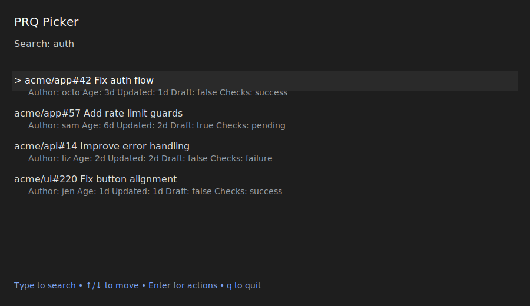

# Usage

## Overview

`prq` is a safe-by-default review helper for GitHub PRs. It lists PRs where you are requested to review, generates a structured review plan using your local Claude Code CLI, and only posts to GitHub after explicit confirmation.

## Global Flag

| Flag | Description |
| --- | --- |
| `--config` | Override the default config path (`~/.prq/config.yaml`). |

## Commands

### `prq doctor`

Checks dependencies and configuration, including `gh` auth and the provider schema.

```bash
prq doctor
```

### `prq queue`

Lists open PRs where you are requested to review, or your own PRs awaiting review.

```bash
prq queue
prq queue --limit 50 --owner my-org
prq queue --repo acme/app --label bug --checks failure
prq queue --draft false --sort updated
prq queue --mine                        # Show your own PRs instead
prq queue --tui
```

| Flag | Description |
| --- | --- |
| `--limit` | Max results (default 200). |
| `--repo` | Filter by repo `OWNER/REPO`. |
| `--owner` | Filter by org/owner. |
| `--label` | Filter by label. |
| `--checks` | Filter by checks: `failure`, `pending`, `success`, `any`. |
| `--draft` | Filter by draft: `true`, `false`, `any`. |
| `--sort` | Sort: `oldest`, `updated`, `ci`, `size`. |
| `--json` | Output JSON. |
| `--tui` | Launch full-screen picker (same as `prq pick`). |
| `--mine` | Show your authored PRs instead of review requests. |

### `prq pick`

Full-screen interactive picker with live search. Type to filter, use arrow keys to select, press Enter to choose an action.

```bash
prq pick
prq pick --mine     # Show your own PRs instead
```

Screenshots:




Keys:

| Key | Action |
| --- | --- |
| `type` | Live search filter. |
| `↑/↓` | Move selection. |
| `Enter` | Open action menu for selected PR. |
| `r` | Review selected PR. |
| `d` | Draft review. |
| `s` | Submit draft. |
| `f` | Follow up. |
| `o` | Open PR in browser. |
| `Esc` | Back to list. |
| `q` | Quit. |

### `prq review`

Generates a structured review plan using the local Claude Code CLI. Also saves a local draft for later submission.

```bash
prq review OWNER/REPO#123
prq review https://github.com/acme/app/pull/123 --format md
prq review acme/app#42 --max-issues 5
prq review acme/app#42 --run-tests
```

| Flag | Description |
| --- | --- |
| `--format` | Output format: `text`, `json`, `md`. |
| `--max-issues` | Limit number of issues in the plan. |
| `--run-tests` | Run `prq.yaml` test commands and include output in the prompt. |

### `prq draft`

Generates a review plan and saves a local draft without posting to GitHub.

```bash
prq draft OWNER/REPO#123
prq draft acme/app#42 --max-issues 5
prq draft acme/app#42 --run-tests
```

| Flag | Description |
| --- | --- |
| `--max-issues` | Limit number of issues in the plan. |
| `--run-tests` | Run `prq.yaml` test commands and include output in the prompt. |

### `prq submit`

Loads the saved draft, shows a preview, asks for confirmation, then posts to GitHub.

```bash
prq submit OWNER/REPO#123
```

Preview only (no posting):

```bash
prq submit OWNER/REPO#123 --dry-run
```

Non-interactive / automation (no prompt):

```bash
prq submit OWNER/REPO#123 --yes
```

| Flag | Description |
| --- | --- |
| `--dry-run` | Preview without posting. |
| `--yes` | Skip confirmation prompt. |

### `prq followup`

Shows open review threads and changes since your last review of the PR.

```bash
prq followup OWNER/REPO#123
```

### `prq config`

Prints merged configuration (user config + repo config).

```bash
prq config
```
